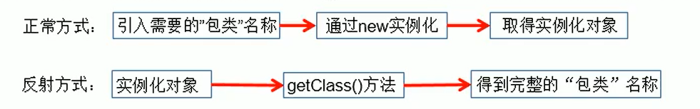
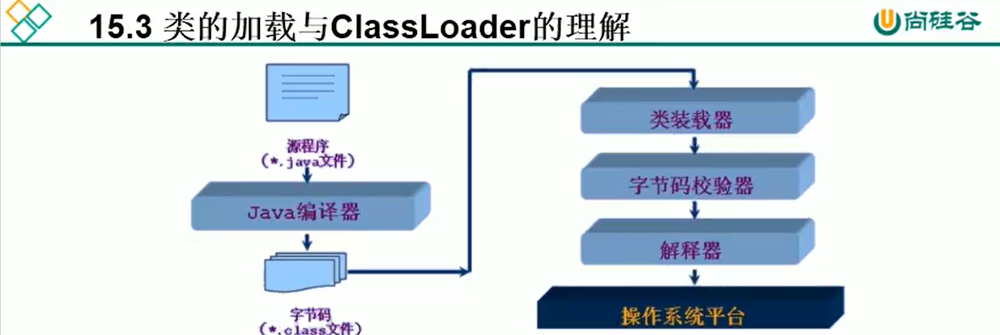

#  一、反射概述

- Reflection（反射）是被视为动态语言的关键，

	反射机制允许程序在执行期借助于Reflection API取得任何类的内部信息，并能直接操作任意对象的内部属性及方法。

- 加载完类之后，在堆内存的方法区中就产生了一个Class类型的对象（一个类只有一个Class对象），这个对象就包含了完整的类的结构信息。我们可以通过这个对象看到类的结构。

	这个对象就像一面镜子，透过这个镜子看到类的结构，所以，我们形象的称之为∶反射。





**Java反射机制提供的功能**

- 在运行时判断任意一个对象所属的类
- 在运行时构造任意一个类的对象
- 在运行时判断任意一个类所具有的成员变量和方法
- 在运行时获取泛型信息
- 在运行时调用任意一个对象的成员变量和方法
- 在运行时处理注解>生成动态代理


- 什么时候会使用∶反射的方式.

	反射的特征∶动态性。比如前端传一个login参数，后端动态建立一个登陆对象。

- 反射机制与面向对象中的封装性是不是矛盾的?

	不矛盾。封装性是一种规范


# 二、Class实例


 **关于`java.lang.Class`类的理解 **

1. 类的加载过程∶


	程序经过`javac.exe`命令以后，会生成一个或多个字节码文件（.class结尾）。


	接着我们使用`java.exe`命令对某个字节码文件进行解释运行。相当于将某个字节码文件加载到内存中。

	此过程就称为类的加载。

	加载到内存中的类，我们就称为运行时类，作为Class的一个实例。

2. 换句话说，Class的实例，就对应着一个运行时类。

	【Class的实例还包含所有已学过的结构，比如接口、枚举类、数组、基本元素类型等】

3. 加载到内存的运行时类，会缓存一段时间。在此时间内，我们可以通过不同的方式来获取此运行时类。


###  获取Class 的实例

```java
@Test
public void test3()throws ClassNotFoundException {

//方式一∶调用运行时类的属性∶
    class Class clazz1 = Person.class; 
    System.out.println(clazz1);

//方式二∶通过运行时类的对象， 调用getClass() 
    Person p1 = new Person(); 
    Class clazz2 = p1.getClass(); 
    System.out.println(clazz2);

//方式三∶调用Class的静态方法∶ forName(String classPath) --------> 常用
    
    //包名.类名
    Class clazz3= Class.forName("com.atguigu.java.Person");

	//clazz3 = Class.forName("java.Lang.String"); 
    System.out.println(clazz3);
    
//方式四:使用类的加载器：ClassLoader
    ClassLoader classLoader = ReflectionTest.class.getClassLoader();
    classLoader.loadClass("com.atguigu.java.Person");
}
```

三种方式建立的是同一个运行时类

```java
System.out.println(clazz1==clazz3);//True
System.out.println(clazz1==clazz2);//True
```


### ClassLoader-类加载器





类加载器的作用

- 将class文件字节码内容加载到内存中，并将这些静态数据转换成方法区的运行时数据结构，然后在堆中生成一个代表这个类的java.lang.Class对象，作为方法区中类数据的访问入口。
- 类缓存：标准的JavaSE类加载器可以按照要求查找类，但一旦某个类被加载到类加载器中，它将维持加载（缓存）一段时间，知道JVM回收这些Class对象


### ClassLoader 读取配置文件


```java
    //ClassLoader读取配置文件
    @Test
    public void test3() throws Exception {
        Properties pros = new Properties();

        // 读取配置文件的方式一∶使用io流
        //此时的文件默以在当前的module 下。
        FileInputStream fis = new FileInputStream("jdbc.properties");
        pros.load(fis);

        //读取配置文件的方式二∶ 使用ClassLoader
        // 配置文件默认识别为∶当前module 的src 下
        ClassLoader classLoader = ReflectTest.class.getClassLoader();
        InputStream is = classLoader.getResourceAsStream("jdbc1.properties");//把资源转换成流的形式
        pros.load(is);
        String user = pros.getProperty("user");
        String password = pros.getProperty("password");
        System.out.println("user =" + user + ",password =" + password);


    }
```


# 三、反射


## 示例


```java
    @Test
    public void test2() throws Exception {
        Class clazz = Person.class;;//一般用包名的方式创建类的Class对象

        //1.通过反射，创建Person类的对象
        //调用构造器
        Constructor cons = clazz.getConstructor(String.class, int.class)
        
        //一般不用有参数的
        Object obj = cons.newInstance("Tom", 12);
        
		//一般用无参数的构造器
        Object obk = clazz.newInstance();//注意是clazz
        
        
        Person p = (Person) obj;
        System.out.println(p.toString());

        //2. 通过反射，调用对象指定的属性、方法
        // 调用属性
        Field age = clazz.getDeclaredField("age");
        age.set(p, 10);
        System.out.println(p.toString());

        //调用方法
        Method show = clazz.getDeclaredMethod("show");
        show.invoke(p);

    //通过反射，也可以调用Person类的私有结构的。比如∶私有的构造器、方法
    }
```


## 动态性


```java
    @Test
    public void test2() throws Exception {
        for (int i=0;i<10;i++){
            int num = new Random().nextInt(3);//0、1、2
            String classPath = "";
            switch (num){
                case 0:
                    classPath = "java.util.Date";
                    break;
                case 1:
                    classPath = "java.lang.Object";
                    break;
                case 2:
                    classPath = "bank.Customer";
            }
            Object obj = Class.forName(classPath).newInstance();
            System.out.println(obj);
        }
    }

/**

Sun Jun 13 14:30:59 CST 2021
Sun Jun 13 14:30:59 CST 2021
Sun Jun 13 14:30:59 CST 2021
Sun Jun 13 14:30:59 CST 2021
Customer{firstName='null', lastname='null', account=null}
Customer{firstName='null', lastname='null', account=null}
Customer{firstName='null', lastname='null', account=null}
Sun Jun 13 14:30:59 CST 2021
java.lang.Object@573fd745
java.lang.Object@15327b79

*/
```


## 获取运行时类的属性结构


### 概览结构

```java
public class FieldTest {

    @Test
    public void test1(){
        Class clazz = Person.class;

        //获取属性的所有结构
        //getFields()方法：获取当前运行时类及其所有父类中所有声明为public的属性
        Field[] fields = clazz.getFields();
        for(Field f:fields){
            System.out.println(f);
            /*
            public int test.Person.id
            public double test.Creature.weight
            */
        }
        
     
        System.out.println();

        //getDeclaredFields():获取当前运行时类自己定义的属性(不包含父类中声明的属性)。
        //注：任何权限的属性都可以拿到
        Field[] declaredField = clazz.getDeclaredFields();
        for(Field f:declaredField){                 
            System.out.println(f);
			/*
			private java.lang.String test.Person.name
            int test.Person.age
            public int test.Person.id
			*/
        }
    }
```


### 具体结构

- 具体结构，包括属性的权限修饰符、数据类型、变量名。

此时要看是静态还是非静态。

如果属性是非静态，则拿不到，因为非静态要有对象才能拿到。

```java
    @Test
    public void test2(){
        Class clazz = Person.class;
        Field[] declaredFields = clazz.getDeclaredFields();
        for(Field f:declaredFields){
            
            //1.获取权限修饰符
            int modifier = f.getModifiers();//获取属性f的权限修饰符
            System.out.print(modifier+"\t");//值和权限有映射关系
            /*
            2
            0
            1
            */
            //把int类型的值翻译成对应的权限。Modifier是一个类
            System.out.print(Modifier.toString(modifier)+"\t");
            
            //注意，默认权限的输出结果为空白
            /*
            private
            
            public
			*/
            
            //2.数据类型
            Class type = f.getType();
            System.out.println(type+"\t");//如果想把输出结果中的class去掉，可以用type.getName()+"\t"
            
            //3.变量名
            String name = f.getName();
            System.out.println(name)

        }
    }
}
```


## 获取运行时类的方法结构


```java
	@Test
    public void test1(){

        Class clazz= Person.class;

        //getMethods()：获取当前运行时类及其父类为public权限的方法
        Method[] methods = clazz.getMethods();
        for (Method m :
                methods) {
            System.out.println(m);
        }
        System.out.println();

        //getDeclaredMethods()：获取当前运行时类当中声明的所有方法（不包含父类中的）
        Method[] declaredMethods = clazz.getDeclaredMethods();
        for (Method m :
                declaredMethods) {
            System.out.println(m);
        }

    }

    /*
    @Xxx
    权限修饰符 返回值类型  方法名(参数类型1 形参名1，...)throws XxxException{
     */
    @Test
    public void test2() {

        Class clazz = Person.class;
        Method[] declaredMethods = clazz.getDeclaredMethods();
        for (Method m :
declaredMethods) {
            
            //1.获取方法声明的注解
            Annotation[] annos = m.getAnnotations();
            for (Annotation a : annos) {
                System.out.println(a);
            }

            //2.权限修饰符
            System.out.print(Modifier.toString(m.getModifiers()) + "\t");

            //3.返回值类型
            System.out.print(m.getReturnType() + "\t");

            //4.方法名
            System.out.print(m.getName());
            System.out.print("(");
            
            //5.形参列表
            Class[] parameterTypes = m.getParameterTypes();
            if (!(parameterTypes == null && parameterTypes.length == 0)) {
                for (int i = 0; i < parameterTypes.length; i++) {
                    if (i == 0) {
                        System.out.print(parameterTypes[i].getName() + " args_" + i);

                    } else {
                        System.out.print("," + parameterTypes[i].getName() + " args_" + i);

                    }
                }

            }

            System.out.print(")");

            //6.抛出异常
            Class[] exceptionTypes = m.getExceptionTypes();

            if (exceptionTypes.length > 0) {
                System.out.print("throw ");
                for (int i = 0; i < exceptionTypes.length; i++) {
                    if (i == exceptionTypes.length - 1) {
                        System.out.print(exceptionTypes[i].getName());
                        break;
                    }
                    System.out.print(exceptionTypes[i].getName() + ",");
                }
            }
            System.out.println();
        }
    }
```


## 获取运行时类的构造器结构

```java
@Test
public void test1(){
    
    Class clazz= Person.class;
    
    //获取当前运行时类中声明为public的构造器
    Constructor[] constructors = clazz.getConstructors();
    for (Constructor c: constructors
         ) {
        System.out.println(c);

    }
    System.out.println();
    
    //获取当前运行时类中声明的所有的构造器
    Constructor[] declaredConstructors = clazz.getDeclaredConstructors();
    for (Constructor c: declaredConstructors
    ) {
        System.out.println(c);
    }

}
```


## 获取运行时类的父类


Person类声明如下：

```java
@MyAnnotation(value = "hi")
public class Person extends Creature<String> implements Comparable<String>,MyInterface{

    private String name;
    int age;
}
```

所以可以去获取Person类父类的泛型


```java
/*
获取运行时类的父类
 */
@Test
public void test2(){
    Class clazz=Person.class;
    Class superclass = (Class) clazz.getSuperclass();
    System.out.println(superclass);
}
```

```java
/*
获取运行时类带泛型的父类
 */
@Test
public void test3(){
    Class clazz=Person.class;
    Type genericSuperclass = clazz.getGenericSuperclass();
    System.out.println(genericSuperclass);
}
```

```java
/*
获取运行时类带泛型的父类的泛型
 */
@Test
public void test4(){
    Class clazz=Person.class;
    Type genericSuperclass = clazz.getGenericSuperclass();
    ParameterizedType parameterizedType=(ParameterizedType) genericSuperclass;
    //获取泛型类型
    Type[] actualTypeArguments = parameterizedType.getActualTypeArguments();
    System.out.println(actualTypeArguments[0].getTypeName());
}
```


## 获取运行时类的所实现的接口，所在包和注解


```java
/*
获取运行时类实现的接口
*/
	@Test
    public void test1(){
        Class clazz = Person.class;
        Class[] interfaces = clazz.getInterfaces();

        for(Class c:interfaces){
            System.out.println(c);//注意Person类继承了Creature类，Creature类还实现了接口，但拿不到
        }

        System.out.println();

        //获取运行时类的父类实现的接口
        Class superclass = clazz.getSuperclass();
        Class[] interfaces1 = superclass.getInterfaces();
        for(Class c:interfaces1){
            System.out.println(c);//interface java.io.Serializable
        }
    }

```

```java
/*
获取运行时类所在的包
*/
    @Test
    public void test1(){
        Class clazz = Person.class;
        Package pack = clazz.getPackage();
        System.out.println(pack);//package test
    }
```

```java
/*
获取运行时类声明的注解
*/
	@Test
    public void test1(){
        Class clazz = Person.class;
        Annotation[] annotations = clazz.getAnnotations();
        for(Annotation a:annotations){
            System.out.println(a);//@test.MyAnnotation(value=hi)         
        }
    }
```


## 调用运行时类的指定属性

对于属性的调用体现在两方面 (前提是要先获取这个属性)

- 获取这个属性的值(体现为get)
- 给这个属性赋一个值(体现为set)

```java
   //方式一：getField()【用的不多】
    @Test
    public void test1() throws NoSuchFieldException, IllegalAccessException, InstantiationException {
        Class clazz = Person.class;

        //获取指定的属性	

        //注意，此方法要求运行时类中的属性声明为public
        //因为属性一般不会声明为public，所以这种方法用的不多
        Field id = clazz.getField()"id");//给的参数是属性名

        //非静态的属性要依托于对象才能设置值,所以要创建运行时类的对象
        Object obj = clazz.newInstance();
        Person p=(Person)obj;

        //设置当前属性的值

        //set()，参数1指明设置哪个对象的属性，参数2指明将此属性设置为多少
        id.set(p,1001);//表示把p对象的id设置为1001(会自动装箱)

        //获取当前某个对象的属性值,因为set的时候用的是Object，所以get的时候用的也是Object，但实际上是int
        Object o = id.get(p);

        int pId=(int)o;
        System.out.println(pId);//1001

        //如果一开始没有使用id.set(p,1001);那么输出的结果为0
        //因为clazz.newInstance();调用空参构造器，使用的是默认值，所以输出结果为0

        //age在Person中声明的为默认权限，如果把上面的程序中getField("id")改成getField("age")，运行会报异常
    }
```

```java
	//方式二，getDeclaredField，【常用】
    @Test
    public void test2() throws IllegalAccessException, InstantiationException, NoSuchFieldException {
        Class clazz = Person.class;

        //1.创建运行时类的对象
        Object obj = clazz.newInstance();
        Person p=(Person)obj;

        //2.getDeclaredField(String Filename),获取指定名字的属性,如果不存在会报异常
        //name在Person类中声明为：private String name
        Field name = clazz.getDeclaredField("name");

        //name.set(p,"Tom");

        //System.out.println(name.get(p));此时属性若非public权限，则会报非法访问异常IllegalAccessException:

        //如果在Person类中改成public String name，就能够正确执行并输出Tom。
        //这个时候虽然是获取到了属性，但不能继续进行set和get操作。


        //解决方法如下
        //3.保证当前属性是可访问的
        name.setAccessible(true);//之后就可以进行修改了

        //4.获取或设置指定对象的属性值
        name.set(p,"Tom");

        System.out.println(name.get(p));//Tom
    }
```


如果想调用静态属性，使用第二个方法

set的第一个参数写当前运行时类`.class`，或者null即可，原因和调用运行时类的静态方法是一样的。
如果是去get静态属性，get(null)即可。


## 调用运行时类的指定方法

​	以Person类中的这个方法为例

```java
    @MyAnnotation
    private String show(String nation){
        System.out.println("我的国籍是:"+nation);
        return nation;
    }
```


对于调用Person类中的静态方法，在Person类中增加静态方法，方法的声明为

```java
    private static void showDesc(){
        System.out.println("最可爱的人");
    }
```


非静态方法&静态方法：

```java
public class FieldTest {

    @Test
    public void test1() throws IllegalAccessException, InstantiationException, NoSuchMethodException, InvocationTargetException {
		
        //非静态的方法必须要有运行时类的对象
        Class clazz = Person.class;
        Object obj = clazz.newInstance();
        Person p=(Person)obj;

        /*
        1.获取指定的某个方法
        getDeclaredMethod()
        参数1为方法名,参数2为可变形参,因为可能存在同名不同形参的方法【重载】，要把形参列表给它，才能够区分方法。
        */
        Method show = clazz.getDeclaredMethod("show", String.class);


        /*
        invoke是调用的意思，也有两个参数。
        第一个是用谁去调用的，因为是非静态方法，所以要用对象去调，参数二为可变形参，要给实参
        */

        //show.invoke(p, "CHN");
        //因为方法的权限是private，报非法访问异常-IllegalAccessException。


        //正确操作

        //保证方法是可访问的【和属性的操作一样】
        show.setAccessible(true);

        show.invoke(p,"CHN");//我的国籍是:CHN

        System.out.println();

        //因为show方法有返回值，并且invoke方法的返回值即为调用的方法的返回值
        Object obj1 = show.invoke(p, "CHN");//obj1实际上是String，也可以进行强转
        System.out.println(obj1);//CHN


        System.out.println("*****************************************");

        //调用静态方法

        //首先还是要拿到这个方法
        Method showDesc = clazz.getDeclaredMethod("showDesc");//因为没有形参列表所以可以不用写，可变形参本身也可以是0个

        //不管方法的权限是什么，最好都这么做
        showDesc.setAccessible(true);

        //调用
        Object obj2 = showDesc.invoke(Person.class);//最可爱的人.调用者为当前类,因为没有参数，所以不用写实参

        //虽然方法是void，即没有返回值，但也可以用Object去接，得到的就是null而已
        System.out.println(obj2);//null


        /*
        注意，Object obj2 = showDesc.invoke(Person.class);
        也可以写成Object obj2 = showDesc.invoke(null);
        结果相同
        
        因为调用的是静态方法，本质上这里写不写都行，但只有第二个是可变形参，第一个不是，所以必须要给第一个参数传一个东西。
        */
        
        /*
        写null也行的原因:
        invoke是通过showDesc调用的，showDesc是通过clazz拿到的，clazz本身(因为它本身就是当前运行时类)就知道静态方法，可以直接调用。
        非静态方法才需要知道是哪个对象，因为不同对象调用的结果可能不一样，静态方法每一个对象调用都一样。
        */

    }
}
```


## 调用运行时类的指定构造器


调构造器是用来造对象，造对象最常用的还是`newInstance()`的方式，即调用空参的构造器，
再采用针对属性的方法对属性进行操作。

`newInstance()`更能利用反射的动态性，我们更希望用反射写出适合于各种情况的功能。


```java
public class FieldTest {

    @Test
    public void test1() throws NoSuchMethodException, IllegalAccessException, InvocationTargetException, InstantiationException {
        Class clazz = Person.class;
        //1.获取指定的构造器
        //参数为可变参数，说明的是参数列表(说的是形参类型，因为也不靠形参名去区分不同的方法，而是形参类型)
        Constructor constructor = clazz.getDeclaredConstructor(String.class);

        //保证此构造器是可访问的
        constructor.setAccessible(true);

        //调用此构造器创建运行时类的对象
        Object obj = constructor.newInstance("Tom");//此方法需要对应的参数
        Person per=(Person)obj;

        //调用Person中的toString方法
        System.out.println(per);//Person{name='Tom', age=0, id=0}
    }
}
```


# 四、代理


## 静态代理

```java

public class Test2 {

	public static void main(String[] args) {
		Server server=new Server();
		ProxyServer proxyserver=new ProxyServer(server);
		
		proxyserver.browse();//形式上是调了代理类对象的方法，实际上在其方法体中调了被代理类的方法
		//在代码层面server并没有显示的去调用browse
	}

}
interface NetWork{
	
	public void browse();//browse指的是浏览
}

//被代理类
class Server implements NetWork{

	@Override
	public void browse() {
		
		System.out.println("真实的服务器来访问网络");
	}
	
}
//代理类，proxy是代理的意思
class ProxyServer implements NetWork{

	private NetWork work;//私有化接口引用变量
	
	//提供当前代理类的构造器
	public ProxyServer(NetWork work) {
		this.work=work;
	}
	
	public void check() {
		System.out.println("联网之前的检查工作");
	}
	
	@Override
	public void browse() {
		
		check();
		work.browse();
	}
	
}
```


## 动态代理

要想实现动态代理，需要解决的问题？
问题一：如何根据加载到内存中的被代理类，动态的创建一个代理类及其对象。
问题二：当通过代理类的对象调用方法a时，如何动态的去调用被代理类中的同名方法a。


```java
package com.ralph.java;

import java.lang.reflect.InvocationHandler;
import java.lang.reflect.Method;
import java.lang.reflect.Proxy;

interface Human{
    String getBelief();
    void eat(String food);
}

//被代理类
class IronMan implements Human{
    @Override
    public String getBelief() {
        return "Fucking Work";
    }

    @Override
    public void eat(String food) {
        System.out.println("Mayble like eat " + food);

    }
}

//动态代理
class ProxyF{

    public static Object getProxyInstance(Object obj){//obj 被代理类的对象
        //2.2
        MyInvocationHandler Handler = new MyInvocationHandler();
        
        Handler.bind(obj); //2.8 进行实际赋值 传入被代理类的对象

        //1.1参数1 obj.getClass().getClassLoader() : 类的加载器
        //1.2参数2 obj.getClass().getInterfaces()  : 代理类和被代理类共同实现的接口
        //1.3参数3 Handler,当动态代理想调用方法（如eat方法）那么传递形参就是Handler，然后Handle才调用2.1的invoke
        return Proxy.newProxyInstance(obj.getClass().getClassLoader(),obj.getClass().getInterfaces(),Handler);


    }
}


//1.3步骤的参数3填写后,就会调用invoke方法，所以要在1中实例化接口类
class MyInvocationHandler implements InvocationHandler {
    
    private  Object obj;              //2.6 在此声明方法 需要使用被代理类的对象进行赋值
   
    public void bind(Object obj){     //2.7 通过绑定方法赋值 相当于实例化
        this.obj = obj;
    }

    //2.1
    //当我们通过代理类的对象，调用方法a时，就会自动的调用如下的方法：invoke()
    //将被代理类要执行的方法a（如eat方法）的功能就声明在invoke()中
    
    //2.4 参数1 Object proxy  代理类的对象 也就是步骤1 return出来的对象
    //2.5 参数2 Method method 就是代理类所调用的方法 也就是被代理类中的方法
    @Override
    public Object invoke(Object proxy, Method method, Object[] args) throws Throwable {
        
        //2.10 参数3 Object[] args  同名方法名
        //2.11 method:即为代理类对象调用的方法，此方法也就作为了被代理类对象要调用的方
        Object invoke = method.invoke(obj, args);  //2.9 obj 被代理类的对象
        return invoke;//2.12 代理类对象调用方法的返回值

    }
}

//测试
public class ProxyTest {
    public static void main(String[] args) {
        IronMan ironMan = new IronMan(); //2中的obj
        
        //3. proxyInstance:代理类的对象
        //造了一个代理类，实现的是和Ironman类一样的接口
        Human proxyInstance = (Human) ProxyF.getProxyInstance(ironMan);
        
        //3.1 当通过代理类对象调用方法时，就会动态的去调用2的invoke方法
        //代理类是动态生成的，没有显示定义
        proxyInstance.eat("cakes"); 
        String belief = proxyInstance.getBelief();
        System.out.println(belief);
    }
}

```

