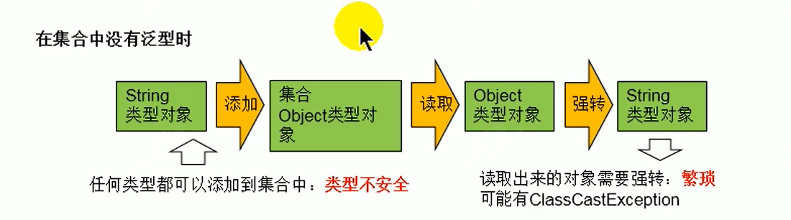

# 一、泛型的概念

> 所谓泛型，就是允许在定义类、接口时通过一个标识，表示类中某个属性的类型或者是某个方法的返回值及参数类型。
>
> 这个类型参数将在使用时（例如，继承或者实现这个接口，用这个类型声明变量、创建对象）确定（即传入实际的类型参数，也称为类型实参）。

- 从JDK1.5以后，Java引入了"参数化类型（Parameterized type）"的概念，允许我们在创建集合时再指定集合元素的类型，正如∶` List<String>`，这表明该List只能保存字符串类型的对象。

- JDK1.5改写了集合框架中的全部接口和类，为这些接口、类增加了泛型支持，从而可以在声明集合变量、创建集合对象时传入类型实参。


## 为什么要有泛型

直接Object不是也可以存储数据吗?

1. 解决元素存储的安全性问题，好比商品、药品标签，不会弄错。

2. 解决获取数据元素时，需要类型强制转换的问题，好比不用每回拿商品、药品都要辨别。




# 二、泛型的使用

在Collection集合中使用泛型

- JDK5.0时，集合接口或者集合类都修改为带泛型的结构。

- 在实例化集合类中，可以指明具体的泛型类型。

- 指明完后，在集合类或者接口中凡是定义类或接口时，内部结构使用到类的泛型的位置，

	都指定为泛型类型。

	如：add(E e)   ----->  实例化后 ： add(Integer e)

	

- 注意：泛型的类型必须是类，不能使用基本数据类型。

	需要用到基本数据类型时，用包装类替换


- 注意：如果实例化时，没有指明泛型的类型。

	则默认为java.lang.Object类型

## ArrayList


```java
    @Test
    public void test(){
//        //以下写法错误，泛型不能使用基本数据类型
//        ArrayList<int> list = new ArrayList<int>();

        //需要使用包装类
        ArrayList<Integer> list = new ArrayList<>();
        
        //此时限制类型为Integer,编译时会进行类型检查
        list.add(78);
        list.add(67);
        
        for (Integer score:list){
            
            //避免了之前使用Object时的强转
            int stuScore = score;
            System.out.println(stuScore);
        }
    }
```


## HashMap

```java
	@Test
    public void test2(){
        HashMap<String, Integer> map = new HashMap<>();
        map.put("Tom",20);
        map.put("Tinna",72);
        map.put("Judy",89);

        System.out.println(map);

        //泛型的嵌套
        Set<Map.Entry<String,Integer>> setEntry = map.entrySet();
        
        Iterator<Map.Entry<String, Integer>> iterator = setEntry.iterator();
        while (iterator.hasNext()){
            Map.Entry<String, Integer> entry = iterator.next();
            System.out.println(entry);
        }
    }
```


# 三、自定义泛型


## 泛型类

注意点

- 泛型类可能有多个参数，此时应将多个参数一起放在尖括号里

  比如：`<E1,E2,E3>`

- 泛型类的构造器 `public Generic(){} `

  而不是 `public Generic<E>(){} `

- 泛型如果不指定，将被擦除，泛型对应的类型均按照Object类型处理，但不等价Object。
- 泛型不能使用基本数据类型，可以用包装类替换。
- 静态方法不能用泛型。
- try-catch中不能使用泛型，异常类不能是泛型。
- 不能使用`new E[]`，但是可以`E[] elements = (E[])new Object[capacity]`

```java
public class Order<T> {
    String orderName;
    int orderID;

    //类的内部结构就可以使用 类的泛型
    T orderT;
    
    public Order(){ }

    public Order(String orderName, int orderID, T orderT) {
        this.orderName = orderName;
        this.orderID = orderID;
        this.orderT = orderT;
    }

    public T getOrderT() {
        return orderT;
    }

    public void setOrderT(T orderT) {
        this.orderT = orderT;
    }
}
```

- 如果如果该类的子类要用泛型

```java
//子类已经确定了泛型
public class SubOrder extends Order<Integer> {
    
}

//子类已经也未确认泛型
public class SubOrder<T> extends Order<T> {
}
```


## 泛型接口

类似泛型类


## 泛型方法